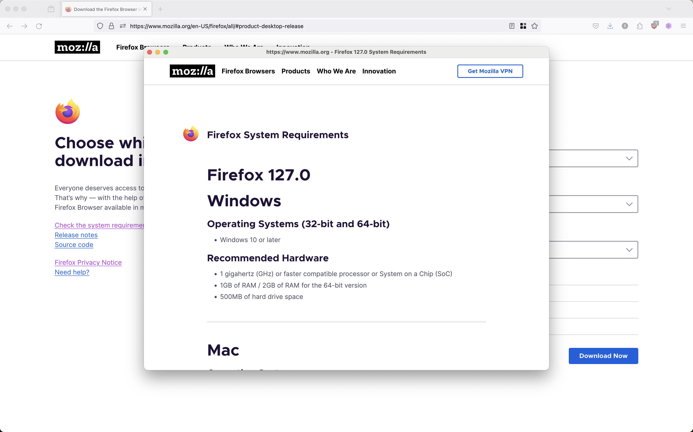
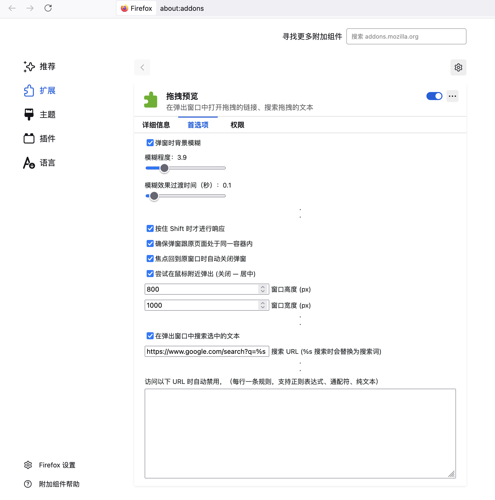

This extension was created to provide ability to quickly preview links without leaving the current page context. It's modified based on this add-on https://github.com/emvaized/open-in-popup-window-extension/tree/main.

Feature:
Dragging any links any text, opens new small window at center without browser controls.

Extension provides several options for popup height/width,  whether to close the popup when origin window regains focus (for example clicked outside of popup).

Privacy:
This extension doesn't collect any private data. It requires access to currently open page in order to get mouse coordinates when popup window was opened.

